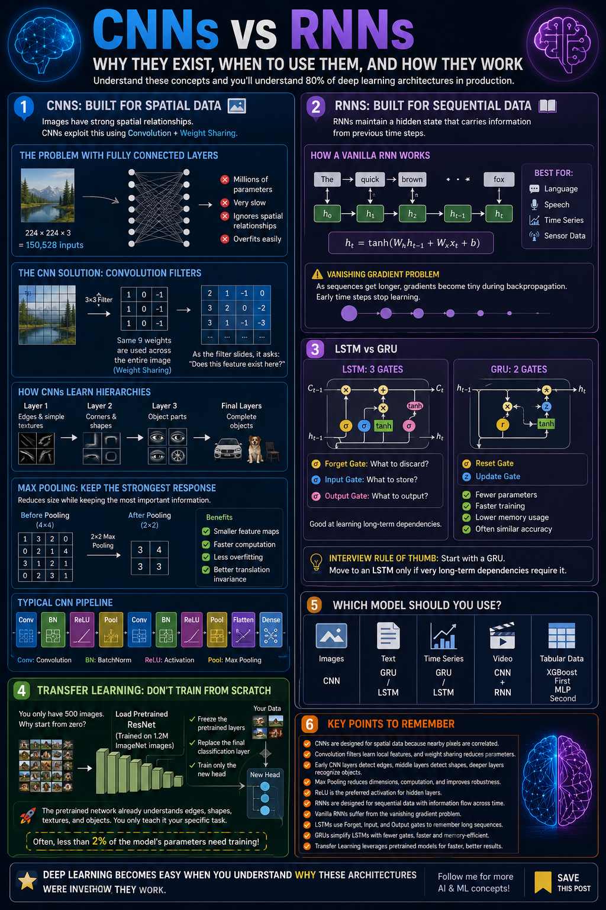

# Convolutional and Recurrent Neural Networks

Today, I am focusing on two specialized neural-network architectures that changed modern AI:

- **Convolutional Neural Networks (CNNs)** for spatial data such as images
- **Recurrent Neural Networks (RNNs) and LSTMs** for sequential data such as text and time series

Yesterday, I built a fully connected neural network. Today, I learned why fully connected networks are not always the best choice and implemented models that take advantage of structure in the data.



## Learning Objectives

By completing this work, I learned how to:

- Explain the difference between fully connected networks, CNNs, and RNNs
- Understand convolution, filters, feature maps, stride, padding, and pooling
- Build and train an image classifier with PyTorch
- Understand hidden states and memory in recurrent networks
- Explain vanishing gradients and how LSTMs address them
- Prepare sequential data using sliding windows
- Build an LSTM model for house-price time-series forecasting
- Preserve chronological order and avoid data leakage in time-series projects

## The Big Idea

A fully connected network treats its inputs as independent features. This loses important relationships in images and sequences.

| Network | Structure it uses | Typical applications |
|---|---|---|
| Fully connected network | No explicit spatial or temporal structure | Tabular data and general classification |
| CNN | Spatial relationships | Images, medical scans, and satellite photos |
| RNN/LSTM | Temporal relationships | Text, prices, sales, and other sequences |

CNNs learn that nearby pixels are related. RNNs learn that earlier values can influence later values.

## Part 1 - Convolutional Neural Networks

### Why CNNs work well with images

A `224 × 224` RGB image contains `150,528` input values. Connecting all of these values to a dense layer with 1,024 neurons would require more than 154 million weights in that layer alone.

CNNs are much more efficient because they:

- Examine small local regions with filters or kernels
- Reuse the same filter across the image through weight sharing
- Preserve spatial relationships between pixels
- Build complex features from simpler ones

Early layers may learn edges, corners, and curves. Deeper layers combine those features into higher-level patterns such as eyes, wheels, doors, or complete objects.

### Convolution

A convolutional filter is a small matrix, such as `3 × 3`, that slides over an image. At each location, the filter and image patch are multiplied element by element and summed to produce one value. Repeating this process creates a **feature map** showing where a learned pattern appears.

Important CNN terms:

| Term | Meaning |
|---|---|
| Filter/kernel | A small learned matrix used to detect a pattern |
| Feature map | The output produced by applying one filter |
| Stride | The number of pixels the filter moves at each step |
| Padding | Extra border values added around an input |
| Channel | The depth dimension of an input or feature map |

With a `3 × 3` kernel, `padding=1` keeps the height and width unchanged. Without padding, each convolution reduces both dimensions by two.

### Pooling

Max pooling reduces a feature map by keeping the largest value in each local region. A `2 × 2` max-pooling layer typically halves the height and width.

This reduces computation and makes the model less sensitive to the exact position of a feature. The model can recognize that a useful feature exists in a region even when it moves slightly.

### CNN architecture implemented

I built a PyTorch CNN using the common pattern:

```text
[Convolution → ReLU → Batch Normalization → Pooling] × N
                         ↓
             Flatten → Dense → Output
```

The house-image model uses three feature-extraction blocks:

```text
RGB input
  → Conv2d(3, 32)   → ReLU → BatchNorm → MaxPool → Dropout
  → Conv2d(32, 64)  → ReLU → BatchNorm → MaxPool → Dropout
  → Conv2d(64, 128) → ReLU → BatchNorm → MaxPool
  → Flatten → Linear(256) → ReLU → Dropout
  → Class scores
```

I also created a runnable CIFAR-10 classifier for `32 × 32` color images. After three pooling operations, the spatial dimensions change as follows:

```text
32 × 32 → 16 × 16 → 8 × 8 → 4 × 4
```

The resulting `128 × 4 × 4` feature tensor is flattened and passed to the classifier. The training workflow includes:

- Image tensor conversion and channel normalization
- Mini-batches of 64 samples
- Adam optimization with a learning rate of `0.001`
- Cross-entropy loss for multiclass classification
- Separate training and evaluation modes
- Validation inside `torch.no_grad()`
- Test accuracy calculated after every epoch

## Part 2 - RNNs and LSTMs

### Why sequence models are needed

The meaning of a current input often depends on earlier inputs. For example, today's house price is related to previous prices, and the meaning of a word depends on the words before it.

An RNN carries a **hidden state** from one time step to the next:

```text
current input + previous hidden state → new hidden state → output
```

This gives the network memory and makes it useful for forecasting, text generation, sentiment analysis, and anomaly detection.

### The limitation of a basic RNN

During backpropagation through a long sequence, gradients can repeatedly shrink. This **vanishing-gradient problem** makes it difficult for a basic RNN to learn long-term dependencies because information from early time steps has little effect on later predictions.

### How LSTM helps

Long Short-Term Memory networks add a cell state and gates that control information flow:

- **Forget gate:** decides which old information to remove
- **Input gate:** decides which new information to store
- **Output gate:** decides which stored information is relevant now

GRUs offer a related design with fewer gates and parameters. LSTMs are often useful for longer or more complex sequences, while GRUs can train faster on simpler tasks.

### Sequence patterns

| Pattern | Example |
|---|---|
| One-to-one | Image classification |
| One-to-many | Image captioning |
| Many-to-one | Sentiment classification or next-month price prediction |
| Many-to-many | Translation or multi-step forecasting |

My house-price forecasting task is **many-to-one**: the previous 12 monthly prices are used to predict the next month.

## House-Price Time-Series Project

I generated 10 years of simulated monthly house prices using:

- A rising long-term trend
- A repeating seasonal component
- Random noise

I then prepared the data as follows:

1. Scaled the prices to the range `0–1` with `MinMaxScaler`.
2. Created sliding sequences with a lookback window of 12 months.
3. Used each 12-month sequence to predict the following month.
4. Split the sequences chronologically into 80% training and 20% testing data.
5. Added a feature dimension so the input shape became `(samples, sequence length, features)`.

The LSTM model contains:

- One input feature per time step
- Two stacked LSTM layers
- 64 hidden units
- Dropout between recurrent layers
- A final linear layer that predicts one price
- `batch_first=True` for `(batch, sequence, feature)` tensors

Because this is a many-to-one task, the model uses only the last LSTM output:

```python
last_output = lstm_out[:, -1, :]
prediction = self.fc(last_output)
```

The training loop uses Adam, mean squared error, and gradient clipping. After training, I inverse-transformed the predictions and plotted predicted prices against actual prices.

## Critical Time-Series Rule

Time-series data must not be shuffled before it is split. Shuffling can put future observations into the training set while earlier observations remain in the test set, causing future information to leak into the model.

```python
# Correct: chronological split
split = int(0.8 * len(X))
X_train, X_test = X[:split], X[split:]
```

## Key Takeaways

- CNNs exploit spatial locality and share learned filters across an image.
- Convolutional layers learn their filters automatically through backpropagation.
- Pooling reduces spatial size and adds some translation tolerance.
- Increasing channels from `32 → 64 → 128` lets deeper CNN layers learn richer features.
- RNNs carry context forward through a hidden state.
- LSTMs use gates and a cell state to preserve useful information over longer sequences.
- Time-series inputs should be scaled because LSTMs are sensitive to feature scale.
- `batch_first=True` uses the tensor order `(batch, sequence, features)`.
- Gradient clipping helps control exploding gradients during recurrent-model training.
- Chronological train/test splitting is essential for realistic forecasting evaluation.

## Project Files

| File | Description |
|---|---|
| `CNN.ipynb` | CNN concepts and image-classification implementation |
| `CNN_RNN.ipynb` | Combined exploration of convolutional and recurrent networks |
| `RNN_LSTM.ipynb` | RNN/LSTM concepts and house-price forecasting implementation |
| `Day-12.png` | Day 12 visual asset |

## Knowledge Check

1. What output shape is produced by `Conv2d(3, 32, kernel_size=3, padding=1)` for a batch of 64 RGB images sized `32 × 32`?
2. Why does a CNN usually require fewer parameters than a fully connected network for image data?
3. What does max pooling do, and why is it useful?
4. What problem does an LSTM address that a basic RNN struggles with?
5. Why should time-series data not be shuffled before the train/test split?

 `(64, 32, 32, 32)`. The batch size remains 64, the layer produces 32 output channels, and `padding=1` preserves the `32 × 32` spatial dimensions for a `3 × 3` kernel with stride 1.

### 2. 

**Answer:** A CNN connects each filter only to a small local region and shares the same filter weights across every image location. A fully connected layer creates a separate weight for every input-to-neuron connection.

### 3. 
**Answer:** Max pooling keeps the largest activation in each local region. It reduces spatial dimensions and computation while retaining strong feature signals and making the model less sensitive to small shifts in feature position.

### 4. 

**Answer:** An LSTM helps address vanishing gradients and the resulting difficulty of learning long-term dependencies. Its cell state and gates allow important information to travel across many time steps.

### 5. 

**Answer:** Shuffling can allow future observations to influence training while earlier observations are used for testing. This data leakage produces an unrealistic evaluation. A chronological split better represents forecasting unseen future values.

## Next Step

Tomorrow will continue the journey with **Transformers and attention mechanisms**, the foundation of modern language models such as GPT and BERT.

